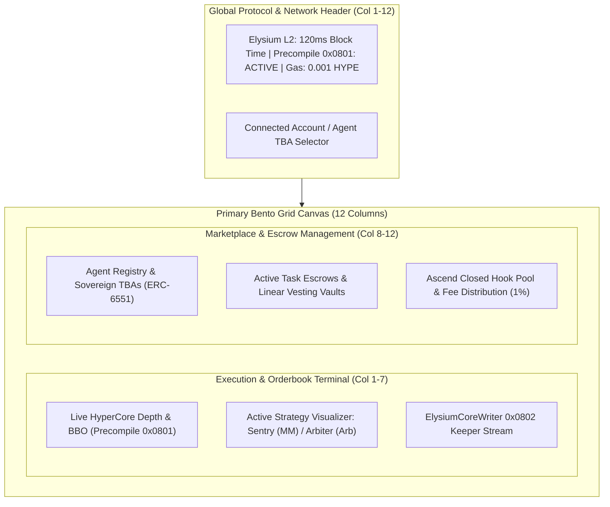
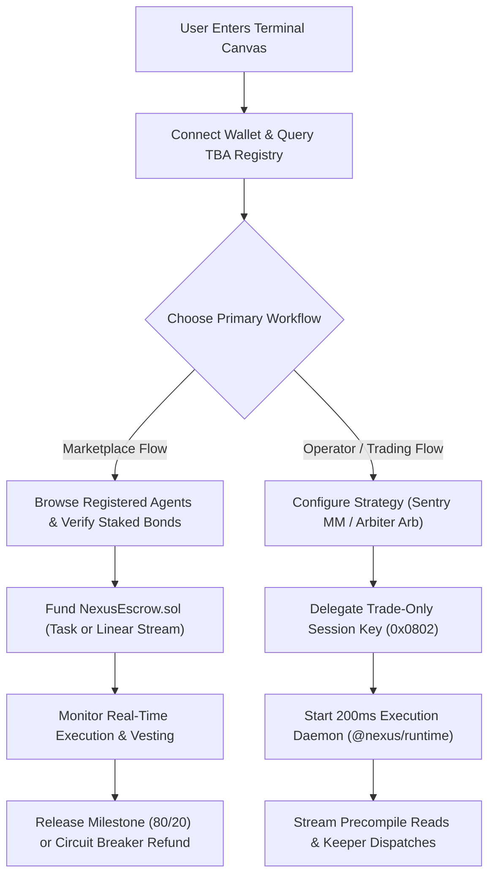

# Design System Specification: Nexus Agents Protocol

> Specification Standard: [getdesign.md](https://getdesign.md) / [designmd.ai](https://designmd.ai)  
> Target Systems: Web3 Frontend Client, Agent Operator Terminal, Marketplace Portal  
> Primary Stack: Vanilla CSS / Tailwind Design Tokens, Semantic HTML5, TypeScript  
> Aesthetic Classification: Cybernetic Pro-Terminal + Modern Modular Bento Grid  

---

## 1. Visual Identity & Design Principles

### 1.1 Philosophy & Persona
Nexus Agents is an institutional sub-second execution engine and decentralized agent marketplace for Elysium L2 and HyperCore. The user interface must reflect:
* **High-Frequency Reactivity**: Real-time telemetry updating at 100–200 ms block resolution without jarring layout shifts or interface flicker.
* **Non-Custodial Trust & Clarity**: Transparent visual cues for token-bound account (TBA) balances, trade-only delegation permissions, and escrow status.
* **Professional Density**: High information density inspired by institutional trading terminals (Hyperliquid, Bloomberg) balanced with modular readability (BentoGrids, Linear).

### 1.2 Core Design Rules

#### Strictly Enforced
* **Dark-Mode Native**: The foundation is deep obsidian (`#080A0F`), never raw `#000000`.
* **Tabular Numbers Everywhere**: All asset quantities, USDC values, spreads, timestamps, and block numbers must use `font-mono` with `font-variant-numeric: tabular-nums`.
* **Zero Emojis**: System status, navigation items, and data badges must utilize SVG icons, geometric status indicators, or clean typographic labels.
* **Hairline Translucent Borders**: Cards and panels must use `1px solid rgba(255, 255, 255, 0.08)`, elevated to accent glow on active or focused states.
* **Sub-Second Feedback**: UI controls must respond within 100ms using GPU-accelerated CSS properties (`transform`, `opacity`).

#### Strictly Prohibited
* No unstyled browser native inputs, buttons, or scrollbars.
* No saturated, generic colors (e.g. standard `#0000FF` or `#FF0000`).
* No layout shifts on WebSocket data pushes; layout boxes must reserve strict dimensional footprints.

---

## 2. Design Tokens & Styling Architecture

### 2.1 CSS Custom Properties (`tokens.css`)

```css
:root {
  /* Surface Layers */
  --color-bg-base: #080A0F;
  --color-bg-surface: rgba(15, 19, 29, 0.72);
  --color-bg-elevated: #121624;
  --color-bg-overlay: rgba(8, 10, 15, 0.85);

  /* Border Tokens */
  --border-subtle: 1px solid rgba(255, 255, 255, 0.08);
  --border-active: 1px solid rgba(255, 255, 255, 0.18);
  --border-glow-cyan: 1px solid rgba(0, 242, 254, 0.40);
  --border-glow-violet: 1px solid rgba(124, 58, 237, 0.40);

  /* Brand & Status Accents */
  --accent-cyan: #00F2FE;
  --accent-violet: #7C3AED;
  --accent-gold: #F59E0B;
  --accent-emerald: #10B981;
  --accent-crimson: #EF4444;

  /* Typography Colors */
  --text-primary: #F8FAFC;
  --text-secondary: #94A3B8;
  --text-muted: #64748B;
  --text-highlight: #38BDF8;

  /* Fonts */
  --font-heading: 'Space Grotesk', -apple-system, sans-serif;
  --font-body: 'Inter', -apple-system, sans-serif;
  --font-mono: 'JetBrains Mono', monospace;

  /* Structural Radii */
  --radius-card: 12px;
  --radius-button: 8px;
  --radius-input: 8px;
  --radius-pill: 9999px;

  /* Motion & Easing */
  --ease-spring: cubic-bezier(0.16, 1, 0.3, 1);
  --transition-fast: 150ms var(--ease-spring);
  --transition-normal: 250ms var(--ease-spring);
  --backdrop-blur: blur(16px);
}
```

---

## 3. Typography Hierarchy & Data Formatting

| Level | Font Family | Size | Weight | Line Height | Tracking | Application Context |
| :--- | :--- | :--- | :--- | :--- | :--- | :--- |
| **Page Title (H1)** | `Space Grotesk` | 32px | 700 | 1.15 | `-0.025em` | Terminal views, Marketplace headers |
| **Section Header (H2)** | `Space Grotesk` | 22px | 600 | 1.25 | `-0.020em` | Bento grid section dividers |
| **Card Title (H3)** | `Space Grotesk` | 16px | 600 | 1.30 | `-0.010em` | Agent identity, Metric module titles |
| **Body Primary** | `Inter` | 14px | 400 | 1.50 | `0` | Descriptions, documentation snippets |
| **Body Secondary** | `Inter` | 12px | 400 | 1.45 | `0` | Parameter labels, secondary notes |
| **Financial Numerics** | `JetBrains Mono` | 14px - 18px | 500 | 1.20 | `0` (tabular) | Spot prices, bid/ask spreads, balances |
| **Status Pills & Tags** | `Inter` | 11px | 600 | 1.00 | `+0.040em` | LIVE, ARBITRAGING, STREAMING badges |

---

## 4. Bento Layout & Spatial Architecture

The primary application canvas uses a **12-Column Asymmetric Bento Grid** configured for pro-tier density:



### 4.1 Responsive Spatial Breakpoints
* **Desktop Pro (`>= 1280px`)**: Full 12-column bento canvas; left panel maintains 7-column execution depth, right panel maintains 5-column marketplace management.
* **Laptop / Tablet (`768px - 1279px`)**: 2-column stacked layout; each section expands to 6 columns.
* **Mobile (`< 768px`)**: Single-column vertical stream; high-frequency orderbook collapses to concise BBO summary card.

---

## 5. Component Anatomy & Interaction States

### 5.1 Real-Time Status Indicators (No Emojis)
Status pills provide deterministic feedback using geometric pulse dots and monospace labels:

```
+------------------------------------+
|  [o] LIVE EXECUTION (140ms)        |  <-- Electric Cyan (.status-live)
+------------------------------------+
|  [o] ARBITRAGE OPPORTUNITY (638 bps)| <-- Emerald Neon (.status-success)
+------------------------------------+
|  [o] CIRCUIT BREAKER SAFE (<6h)    |  <-- Amber (.status-warning)
+------------------------------------+
```

* **Live Pulse Dot**: 6px circle with CSS outer ring animation (`box-shadow: 0 0 0 0 rgba(0, 242, 254, 0.7)` expanding to `6px`).
* **Border Styling**: `1px solid rgba(255, 255, 255, 0.08)`.

### 5.2 Agent Marketplace Card
Each agent card in the marketplace displays its sovereign identity, bound TBA address, strategy parameters, and economic model:

```
+-------------------------------------------------------------+
| AGENT #001: NEXUS ALPHA SENTRY                 [VERIFIED]   |
| TBA: 0x4B3A...91F2 | Strategy: Avellaneda-Stoikov AMM       |
|-------------------------------------------------------------|
| Staked Bond: 5,000 $NEXUS      | 30D Volume: $1,420,000 USDC |
| Inventory Balance: 10,000 NEXUS | USDC Reserve: 20,000 USDC  |
| Fee Allocation: 80% TBA        | Protocol Burn: 20%         |
|-------------------------------------------------------------|
| [ HIRE AGENT VIA ESCROW ]      | [ VIEW EXECUTION TELEMETRY ]|
+-------------------------------------------------------------+
```

### 5.3 Escrow & Payment Streaming Meter
Continuous retainers and milestone escrows visualize remaining duration and linear vesting:

```
+-------------------------------------------------------------+
| ACTIVE ESCROW #42 — ARBITER CROSS-VENUE RETAINER            |
| Deposited: 2,500 USDC | Vested: 1,850 USDC (74%)            |
| [======================================------] 74% Vested   |
| Linear Rate: 0.00096 USDC/sec | Circuit Breaker: 5h 42m Safe |
|-------------------------------------------------------------|
| [ RELEASE MILESTONE ]          | [ CLAIM TIMEOUT REFUND ]   |
+-------------------------------------------------------------+
```

### 5.4 Order Intent Fast-Lane Visualizer
Visual representation of transactions flowing through the `0x0802` predeploy:

```
[Agent TBA] ---> staticcall(0x0801) ---> [~70ms Synchronous L1 Read]
     |
     +---------> emit OrderIntent(0x0802) ---> [Keeper Relayer] ---> [HyperCore CLOB]
```

---

## 6. Micro-Interactions & Animation Physics

### 6.1 Interactive States
* **Hover State (Cards)**:
  * `transform: translateY(-2px)`
  * `border-color: rgba(255, 255, 255, 0.16)`
  * `box-shadow: 0 8px 24px -4px rgba(0, 0, 0, 0.5)`
  * Duration: `150ms var(--ease-spring)`
* **Active Press (Buttons)**:
  * `transform: scale(0.98)`
  * Duration: `100ms ease-out`
* **Data Refresh Flash**:
  * When a new tick arrives via `0x0801`, the updated numeric cell flashes cyan (`rgba(0, 242, 254, 0.20)`) for 120ms before smoothly decaying.

### 6.2 Loading & Skeleton State
* Skeleton elements use `--color-bg-elevated` with a linear shimmer gradient moving at `1.8s` cycles:
  `background: linear-gradient(90deg, #121624 0%, #1A2135 50%, #121624 100%)`.

---

## 7. User Flow State Machine



---

## 8. Implementation Checklist

- [ ] CSS custom properties defined in root stylesheet matching token matrix
- [ ] Tabular numeric font loaded (`font-variant-numeric: tabular-nums`)
- [ ] Translucent glassmorphism applied with `backdrop-filter: blur(16px)`
- [ ] 12-column responsive bento grid implemented with CSS Grid
- [ ] Micro-interactions restricted strictly to `transform` and `opacity`
- [ ] Real-time tick update flashes capped at 120ms decay to prevent eye fatigue
- [ ] High-contrast accessibility verified (WCAG AA compliant across all text levels)
- [ ] Zero emojis present in production code, UI assets, and telemetry strings
