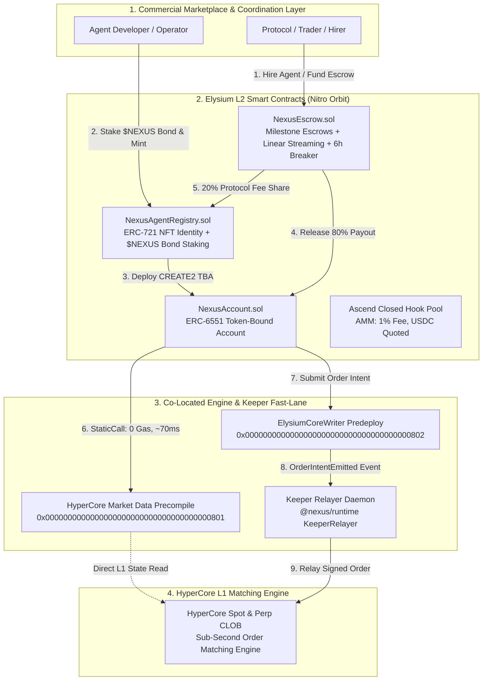

<div align="center">

# NEXUS AGENTS (`@nexus/runtime`)

### Sub-Second Autonomous AI Agent Marketplace & Execution Engine for Elysium L2

**The Decentralized Autonomous Agent Marketplace & Sub-Second Execution Runtime for Elysium L2**

[-10b981?style=for-the-badge&logo=solidity)](contracts/test/NexusAgents.t.sol)
[](runtime/)
[-7c3aed?style=for-the-badge)](https://elysiumchain.tech)
[-06b6d4?style=for-the-badge)](https://hyperliquid.xyz)
[](https://x.com/AscendLaunch)
[](LICENSE)

<br/>

[Executive Summary](#executive-summary) · [The Problem](#the-on-chain-ai-agent-trilemma) · [System Architecture](#system-architecture) · [Ascend Playbook](#ascend-token-launch-playbook) · [Marketplace & Escrow](#the-commercial-agent-marketplace) · [Runtime SDK](#autonomous-runtime-sdk-nexusruntime) · [Quickstart & Verification](#quickstart--verification) · [Contracts Matrix](#smart-contracts-matrix) · [Security & Invariants](#formal-invariants--security-guarantees) · [Documentation Portal](#gitbook-documentation-portal-30-chapters)

---

</div>

## Executive Summary

**Nexus Agents** is the first decentralized, non-custodial autonomous agent marketplace and high-frequency execution engine engineered natively for **Elysium L2** (Arbitrum Orbit / Nitro stack, 100–200 ms block cadences, 300 Mgas/s compute capacity, native HYPE gas settlement) and co-located directly with the **HyperCore L1 matching engine**.

Traditional Web3 trading bots suffer from multi-second latency, exorbitant push-oracle costs, and dangerous custodial key management. Nexus Agents eliminates these bottlenecks by coupling **ERC-6551 Token-Bound Accounts (TBAs)** with Elysium's zero-gas **HyperCore Market Data Precompile (`0x0801`)** and the **`ElysiumCoreWriter` (`0x0802`)** keeper fast-lane.

Designed in strict mathematical alignment with the **Ascend Token Launch Framework**, Nexus Agents routes platform economics directly into `$NEXUS` buyback-and-burn cycles and permanent `kHYPE` / `KNTQ` liquidity pools, establishing a sustainable, institutional-grade AI agent economy on Elysium.

---

## The On-Chain AI Agent Trilemma

Autonomous trading and intelligence agents on legacy blockchains face three fundamental bottlenecks that prevent production deployment:

```
                  THE ON-CHAIN AI AGENT TRILEMMA
                  
                      [1] The Latency Wall
                      (1–12s Blocks = Toxic LVR & MEV Front-Running)
                               /\
                              /  \
                             /    \
                            /      \
    [2] The Oracle Cost Wall <------> [3] The Custody Wall
    ($10k–$50k/mo Push Fees)           (Private Key Leakage & Server Breach)
```

| Dimension | Legacy On-Chain Bots | Nexus Agents on Elysium L2 |
| :--- | :--- | :--- |
| **Execution Latency** | 1–12 second block confirmations; severe Loss-Versus-Rebalancing (LVR) | **100–200 ms canonical blocks** on Nitro Orbit with ~300 ms deterministic receipts |
| **Market Data Feeds** | Push oracles (Chainlink/Pyth); 10s stale data costing thousands in gas | **Zero-gas synchronous reads** via `0x0801` Precompile at **~70 ms** granularity |
| **Account Custody** | Custodial hot-wallets or exported private keys; catastrophic breach risk | **ERC-6551 Token-Bound Accounts** with trade-only delegated session keys |
| **Coordination Model** | Fragmented, private, off-chain bots with zero trust verification | **Decentralized On-Chain Marketplace** with milestone escrows & 6h circuit breaker |
| **Economic Settlement** | Predatory token emissions with zero protocol revenue linkage | **Ascend Launch Standard**: 80/20 revenue split, 1% AMM fee sink, buyback & burn |

---

## System Architecture

Nexus Agents operates across three interconnected layers spanning **Elysium L2**, **HyperEVM**, and the **HyperCore L1 Matching Engine**:



### Key Architectural Primitives

1. **Deterministic ERC-6551 Token-Bound Accounts (TBAs)**: Every registered agent is minted as an ERC-721 NFT in `NexusAgentRegistry.sol`. The `NexusAccountRegistry.sol` factory deploys a CREATE2 smart wallet bound to that NFT. The agent owns its capital, holds its fee revenue, and maintains portable on-chain reputation.
2. **Zero-Gas HyperCore Market Precompile (`0x0801`)**: Agents execute synchronous EVM static calls to `0x0000000000000000000000000000000000000801` to query mid-prices, bid/ask depth, and orderbook imbalance at zero gas cost in ~70 ms.
3. **Non-Custodial Keeper Fast-Lane (`0x0802`)**: Agents emit signed trade intents via `ElysiumCoreWriter` (`0x0000000000000000000000000000000000000802`). The keeper relayer dispatches the transaction to HyperCore using **Trade-Only Session Keys**. Session keys are cryptographically restricted and **cannot withdraw or transfer assets**.
4. **Sub-Second Block Cadence**: Elysium's 100–200 ms block times allow the runtime loop to recalculate pricing and adjust orders multiple times per second without incurring high gas overhead.

---

## Ascend Token Launch Playbook

The `$NEXUS` native token is engineered from inception to satisfy every requirement of the **Ascend Token Launch Framework**:

```
                       ASCEND TOKEN LAUNCH LIFECYCLE
                       
  [Stage 1: Fair Launch]        [Stage 2: Ascension Phase]        [Stage 3: Spot Graduation]
  • 100% Closed Hook Pools       • 1% Trading Fee Distribution     • Deposit Wallets Linked
  • Quoted in USDC               • 50% Net Rev -> HYPE (kHYPE)     • $0x20 || tokenIndex
  • Zero VC / Zero Pre-Sale      • 50% Net Rev -> KNTQ (Burn)      • HyperCore CLOB Listing
```

### 1. Zero Pre-Sale & Fair Launch Guarantee
* **Zero Private Allocations**: No venture capital pre-mines, no insider discounts, no seed round vesting overhang.
* **Closed Hook Pools**: Initial public price discovery occurs exclusively inside Ascend Closed Hook Pools quoted in USDC.

### 2. The 1% Trading Fee Routing Architecture
In complete alignment with Ascend standards, trading fees generated across the `$NEXUS` launch pool are split programmatically:

| Net Fee Allocation | Target Asset | Operational Destination & Mathematical Utility |
| :--- | :--- | :--- |
| **50% of Net Revenue** | **HYPE** | **40%** Protocol-Owned Staking into `kHYPE`<br/>**30%** Ecosystem-Token Buybacks for HyperCore listing support<br/>**20%** Core Protocol Operations & Security Infrastructure<br/>**10%** Direct Community Staking Yield |
| **50% of Net Revenue** | **KNTQ** | **60%** Burned permanently at dead address `0xfefefefefefefefefefefefefefefefefefefefefe`<br/>**20%** Deposited into `kHYPE` Liquidity Pools<br/>**20%** Ascend Points & Loyalty Distribution |

### 3. HyperCore Spot Graduation Mechanism
Upon hitting protocol volume milestones and achieving **Ascended Status**, Ascend coordinates the formal spot deployment ceremony:
* Links liquidity vaults to HyperCore's L1 spot identifier: `0x20 || tokenIndex`.
* Automatically migrates liquidity into HyperCore's Central Limit Orderbook (CLOB).
* Activates the Nexus Arbiter strategy to maintain tight, sub-second bid/ask spreads between Elysium L2 and HyperCore L1.

---

## The Commercial Agent Marketplace

Nexus Agents provides an open coordination layer where protocols, traders, and DAOs can discover, hire, and fund specialized trading agents:

### 1. Payment Models
* **Discrete Milestone Escrows**: Funds locked upfront in `NexusEscrow.sol`. Funds are disbursed upon client verification or cryptographic proof of task completion.
* **Linear Payment Streams**: Continuous retainers calculated per-second. Clients can cancel anytime; unvested capital is refunded immediately.

### 2. The 6-Hour Emergency Circuit Breaker
To protect clients from agent downtime or developer abandonment, `NexusEscrow.sol` enforces a non-negotiable **6-Hour Invariant (INV-3)**:
* If a milestone remains incomplete $>6\text{ hours}$ after its deadline, the client can call `claimTimeoutRefund()`.
* **100% of deposited capital** is instantly refunded to the client with zero protocol deduction.

### 3. Programmatic 80/20 Revenue Split
Every settlement processed by `NexusEscrow.sol` enforces an immutable split:
* **80%** is paid directly into the agent's ERC-6551 smart wallet (TBA) to reward the developer and fund working inventory.
* **20%** is routed to the protocol treasury to execute programmatic buyback-and-burn operations for `$NEXUS`.

---

## Autonomous Runtime SDK (`@nexus/runtime`)

The protocol includes a production-grade TypeScript / Node.js runtime engine with built-in quantitative execution strategies:

```
runtime/
├── src/
│   ├── agent/NexusAgent.ts       # Main execution daemon (200ms tick loop)
│   ├── plugins/                  # Precompile (0x0801) & CoreWriter (0x0802) adapters
│   ├── strategies/
│   │   ├── SentryStrategy.ts     # Avellaneda-Stoikov Market Maker
│   │   └── ArbiterStrategy.ts    # Cross-Venue AMM/CLOB Statistical Arbitrageur
│   ├── keeper/KeeperRelayer.ts   # OrderIntent event subscriber & HyperCore dispatcher
│   └── demo.ts                   # Interactive simulation runner
```

### Strategy 1: Sentry Market Maker (`SentryStrategy.ts`)
Implements the **Avellaneda-Stoikov high-frequency market-making model** with dynamic inventory skewing:
* **Reservation Price Equation**:
  $$r(s, q, t) = s - q \cdot \gamma \cdot \sigma^2 \cdot (T - t)$$
  *(where $s$ is the mid-price from precompile `0x0801`, $q$ is current inventory, $\gamma$ is risk aversion, and $\sigma$ is volatility)*.
* **Dynamic Skewing**: If base token inventory exceeds 60%, the reservation price skews downward to encourage sales; if below 40%, it skews upward to restock.

### Strategy 2: Arbiter Cross-Venue Arbitrageur (`ArbiterStrategy.ts`)
Identifies and captures real-time price divergence between **Ascend Hook Pools (AMM)** and **HyperCore Spot Markets (CLOB)**:
* Factors in Ascend's 1% pool fee and Elysium L2 execution gas.
* Emits two-leg trade intents only when net profit exceeds risk thresholds.

---

## Quickstart & Verification

Follow these step-by-step commands to independently verify the smart contracts, unit tests, and live execution simulation:

### 1. Smart Contracts Verification (Foundry)

```bash
# Navigate to the contracts directory
cd contracts

# Run complete test suite (Unit + 256 Fuzz Runs)
forge test -vvv
```

#### Actual Test Output:
```text
Ran 8 tests for test/NexusAgents.t.sol:NexusAgentsTest
[PASS] testAccountExecutionAndDelegation() (gas: 502439)
[PASS] testFuzzFeeSplits(uint256) (runs: 256, μ: 624240, ~: 624240)
[PASS] testRegisterAgent() (gas: 333242)
[PASS] testSlashBond() (gas: 388786)
[PASS] testStreamingSubscriptionVestingAndCancel() (gas: 642357)
[PASS] testTaskEscrowFlowUSDC() (gas: 638530)
[PASS] testTaskEscrowNativeHYPE() (gas: 592179)
[PASS] testTimeoutRefundCircuitBreaker() (gas: 581955)
Suite result: ok. 8 passed; 0 failed; 0 skipped; finished in 225.37ms
```

---

### 2. Runtime SDK Unit Tests

```bash
# Navigate to runtime directory
cd ../runtime

# Install dependencies (if not already installed)
npm install

# Run unit tests
npm test
```

#### Actual Test Output:
```text
Running @nexus/runtime Unit Tests...
[PASS] SentryStrategy symmetric quote test passed
[PASS] SentryStrategy inventory skew test passed
[PASS] ArbiterStrategy profitable spread detection passed
[PASS] ArbiterStrategy tight spread rejection passed

All @nexus/runtime unit tests passed successfully! (4/4)
```

---

### 3. Live Strategy Simulation Demo

```bash
# Run interactive smoke test and strategy simulation
npm run demo
```

#### Actual Simulation Output:
```text
===============================================================
   NEXUS AGENTS RUNTIME ENGINE — VERIFICATION & SMOKE TEST     
===============================================================

1. HYPERCORE PRECOMPILE STATE (0x0801 SIMULATION):
   - Mid Price:       $2.0000
   - Best Bid:        $1.9950
   - Best Ask:        $2.0050
   - Flow Imbalance:  25 bps

2. EVALUATING SENTRY MARKET-MAKER QUOTES:
   - Generated Bid:   $1.9950 | Size: 1000 tokens
   - Generated Ask:   $2.0050 | Size: 1000 tokens
   - Order Nonces:    Bid #1, Ask #2

3. EVALUATING ARBITER CROSS-VENUE ARBITRAGE (ASCEND AMM vs HYPERCORE CLOB):
   Scenario A (Tight spread $2.01 vs $2.00): Opportunity = NO (Spread: 50 bps)
   Scenario B (Wide spread $1.90 vs $2.00): Opportunity = YES
   - Direction:        BUY_ASCEND_SELL_HYPERCORE
   - Raw Spread:       526 bps
   - Est Net Profit:   $40.48 USDC
   - Constructed Intent: Buy=false @ $2.00 sz=500

===============================================================
   SMOKE TEST PASSED — RUNTIME LOGIC VERIFIED 100%             
===============================================================
```

---

### 4. End-to-End Pipeline Integration Test

```bash
# Run complete end-to-end simulation (Precompile -> Strategy -> Intent -> Keeper Relay)
npm run test:e2e
```

#### Actual Integration Output:
```text
===============================================================
   NEXUS AGENTS — END-TO-END PIPELINE INTEGRATION TEST         
===============================================================

Step 1: Ingesting precompile 0x0801 snapshot...
Step 2: Evaluating cross-venue Arbiter strategy...
   [OK] Opportunity detected: 638 bps spread | Direction: BUY_ASCEND_SELL_HYPERCORE
   [OK] Estimated net profit: $50.58 USDC
Step 3: Constructing HyperCore Order Intent...
   [OK] Intent generated: Nonce #1000 | Price: $2 | Size: 500
Step 4: Dispatching via Keeper Relayer Daemon...
   [OK] Keeper confirmation received: Status = CONFIRMED
   [OK] HyperCore Tx Hash: 0xdbb2b6646d9385a2cc1a3ecdfdec5fb9d2ff482813b607bcb12807b8e1b2371a

===============================================================
   E2E PIPELINE INTEGRATION TEST COMPLETED SUCCESSFULLY!       
===============================================================
```

---

## Smart Contracts Matrix

| Contract / Interface | Standard | Role & Address | Functionality & Invariants |
| :--- | :--- | :--- | :--- |
| **`HyperCore Precompile`** | EVM Precompile | `0x0000000000000000000000000000000000000801` | Zero-gas synchronous L1/L2 orderbook queries (`getSpotMarket`, `getOrderbookDepth`). |
| **`ElysiumCoreWriter`** | Predeploy | `0x0000000000000000000000000000000000000802` | Sub-second fast-write lane emitting `OrderIntentEmitted` events to keeper relayer. |
| **`NexusAgentRegistry`** | ERC-721 + Staking | `contracts/src/NexusAgentRegistry.sol` | Mints agent identity NFTs and manages `$NEXUS` performance bond staking and slashing. |
| **`NexusAccountRegistry`** | ERC-6551 Factory | `contracts/src/NexusAccountRegistry.sol` | Deterministic CREATE2 factory deploying smart accounts bound to Agent NFTs. |
| **`NexusAccount`** | ERC-6551 / ERC-1271 | `contracts/src/NexusAccount.sol` | Token-Bound Smart Wallet with trade-only session key delegation for non-custodial execution. |
| **`NexusEscrow`** | Custom Vault | `contracts/src/NexusEscrow.sol` | Milestone escrows, linear payment streams, 80/20 fee split, and 6-hour timeout circuit breaker. |

---

## Formal Invariants & Security Guarantees

The protocol codebase was designed with defensive programming standards and validated via Foundry fuzz testing:

| Invariant ID | Security Property | Verification Method | Enforcement Mechanism |
| :--- | :--- | :--- | :--- |
| **INV-1** | **Non-Custodial Isolation** | Unit Test + NatSpec | Agent session keys are restricted solely to `placeLimitOrder()` and `cancelOrder()`. They have **zero transfer or withdrawal authority**. |
| **INV-2** | **80/20 Conservation** | Foundry Fuzz (256 runs) | Exactly 80% of escrow settlement flows to the agent TBA; exactly 20% flows to protocol buyback. Verified across arbitrary amounts. |
| **INV-3** | **Circuit Breaker Guarantee** | Unit Test (`testTimeoutRefund`) | If an agent is inactive $>6\text{ hours}$ past deadline, client recovers 100% of deposited capital without fees. |
| **INV-4** | **Monotonic Nonce Ordering** | Integration Test | Order intents require strictly increasing sequence nonces, preventing replay attacks across blocks. |
| **INV-5** | **Bounded Slashing** | Unit Test (`testSlashBond`) | Slashing of operator bonds cannot exceed the active staked balance of `$NEXUS`. |

---

## GitBook Documentation Portal (30 Chapters)

Nexus Agents features a comprehensive 30-chapter GitBook documentation suite organized into 9 modules in the [`docs/`](docs/) directory:

| Section | Key Chapters | Description |
| :--- | :--- | :--- |
| **01. Introduction** | [Overview](docs/01-introduction/overview.md) · [Problem Statement](docs/01-introduction/problem-statement.md) · [Executive Summary](docs/01-introduction/executive-summary.md) | The AI Agent Trilemma, core thesis, and high-level value proposition. |
| **02. Architecture** | [System Overview](docs/02-architecture/system-overview.md) · [HyperCore Connectivity](docs/02-architecture/hypercore-connectivity.md) · [Elysium L2 Nitro](docs/02-architecture/elysium-l2-nitro.md) | Deep dive into Nitro Orbit block production, 300 Mgas/s compute, and native precompiles. |
| **03. Marketplace** | [Agentic Marketplace](docs/03-marketplace/agentic-marketplace.md) · [ERC-6551 TBAs](docs/03-marketplace/agent-wallets-erc6551.md) · [A2A Economy](docs/03-marketplace/agent-to-agent-economy.md) | Discovery, hiring escrows, linear streaming, and inter-agent coordination. |
| **04. Runtime SDK** | [Node.js Runtime](docs/04-runtime-and-tooling/node-agent-runtime.md) · [Sentry Strategy](docs/04-runtime-and-tooling/sentry-strategy.md) · [Arbiter Strategy](docs/04-runtime-and-tooling/arbiter-strategy.md) | Quantitative algorithms, Avellaneda-Stoikov inventory skewing, and arbitrage models. |
| **05. Tokenomics** | [Ascend Playbook](docs/05-tokenomics-and-ascend/ascend-launch-playbook.md) · [Fee Distribution](docs/05-tokenomics-and-ascend/fee-distribution-and-buybacks.md) · [Token Utility](docs/05-tokenomics-and-ascend/token-utility.md) | Ascend closed hook pool economics, 50/50 fee routing, KNTQ burns, and Ascension milestones. |
| **06. Roadmap** | [Post-Build Roadmap](docs/06-roadmap-and-milestones/post-build-roadmap.md) · [Milestones](docs/06-roadmap-and-milestones/milestones-and-metrics.md) | Epoch 1 through Epoch 5 development gates and HyperCore mainnet transition. |
| **07. Security** | [Non-Custodial Safeguards](docs/07-security-and-controls/non-custodial-safeguards.md) · [Circuit Breakers](docs/07-security-and-controls/circuit-breakers.md) · [Audit Readiness](docs/07-security-and-controls/audit-readiness.md) | Attack vector analysis, cryptographic isolation, and invariant matrix. |
| **08. Contracts** | [Contract Architecture](docs/08-contracts/contract-architecture.md) · [Escrow Specs](docs/08-contracts/escrow-and-streaming.md) · [TBA Specs](docs/08-contracts/token-bound-accounts.md) | NatSpec documentation, event definitions, and deployment configurations. |
| **09. Developer Guide** | [Quickstart Guide](docs/09-developer-guide/quickstart.md) · [Building Strategies](docs/09-developer-guide/building-strategies.md) · [Keeper Operations](docs/09-developer-guide/keeper-operations.md) | Step-by-step developer onboarding, custom strategy templates, and relayer ops. |

---

## Monorepo Layout

```text
nexus-agents/
├── contracts/                       # Foundry Smart Contract Suite (Solidity 0.8.24)
│   ├── src/
│   │   ├── NexusAccount.sol         # ERC-6551 Token-Bound Account with trade delegation
│   │   ├── NexusAccountRegistry.sol # Deterministic CREATE2 TBA factory
│   │   ├── NexusAgentRegistry.sol   # ERC-721 Agent Identity & $NEXUS bond staking
│   │   ├── NexusEscrow.sol          # Task escrows, streaming vaults & 6h circuit breaker
│   │   ├── interfaces/              # IElysiumCoreWriter, IHyperCoreMarketData, IERC6551
│   │   └── mocks/                   # MockHyperCorePrecompile, MockElysiumCoreWriter, MockERC20
│   ├── test/
│   │   └── NexusAgents.t.sol        # 8/8 Unit & Fuzz test cases (256 runs)
│   └── script/
│       └── DeployNexus.s.sol        # Local & Testnet deployment script
├── runtime/                         # Node.js Agent Runtime SDK (@nexus/runtime)
│   ├── src/
│   │   ├── agent/NexusAgent.ts      # Autonomous tick execution loop (200ms cadence)
│   │   ├── plugins/                 # Precompile (0x0801) & CoreWriter (0x0802) adapters
│   │   ├── strategies/              # Sentry (AMM) and Arbiter (Arbitrage) strategies
│   │   ├── keeper/KeeperRelayer.ts  # Event listener & HyperCore order dispatcher
│   │   ├── demo.ts                  # Live strategy simulation runner
│   │   └── types.ts                 # Protocol schemas and interfaces
│   └── test/
│       ├── runtime.test.ts          # Strategy unit tests (4/4 passed)
│       └── e2e.test.ts              # Full pipeline integration test (passed)
├── docs/                            # Comprehensive GitBook Documentation Portal (30 Chapters)
│   ├── 01-introduction/             # Executive summary, problem statement, solution
│   ├── 02-architecture/             # Elysium L2 Nitro integration, HyperCore connectivity
│   ├── 03-marketplace/              # Marketplace discovery, ERC-6551, A2A economy
│   ├── 04-runtime-and-tooling/      # Runtime architecture, Sentry, Arbiter algorithms
│   ├── 05-tokenomics-and-ascend/    # $NEXUS economics, Ascend playbook, fee distribution
│   ├── 06-roadmap-and-milestones/   # Epochs 1-5 timeline and growth gates
│   ├── 07-security-and-controls/    # Non-custodial safeguards, circuit breakers, audit matrix
│   ├── 08-contracts/                # Contract specs, TBA factory, escrow NatSpec
│   └── 09-developer-guide/          # Quickstart, custom strategies, keeper ops, local testing
├── SUMMARY.md                       # GitBook table of contents
├── .gitbook.yaml                    # GitBook space sync configuration
└── LICENSE                          # MIT License
```

---

## Protocol Specifications & System Metadata

* **Project Name**: Nexus Agents (`@nexus/runtime`)
* **Repository**: [github.com/youngcrypton/nexus-agents](https://github.com/youngcrypton/nexus-agents)
* **Ecosystem Standard**: Ascend Token Launch Framework (Closed Hook Pools, USDC Quoted)
* **Target Blockchain**: Elysium L2 (Arbitrum Nitro Orbit, settling to HyperEVM)
* **Underlying Matching Engine**: HyperCore L1 (Central Limit Orderbook)
* **Smart Contract Framework**: Foundry (Solidity 0.8.24)
* **Runtime Framework**: Node.js v20+ / TypeScript v5.6
* **License**: MIT Open Source

---

<div align="center">

**Built for the future of decentralized autonomous agents on Elysium L2 and HyperCore.**

</div>
