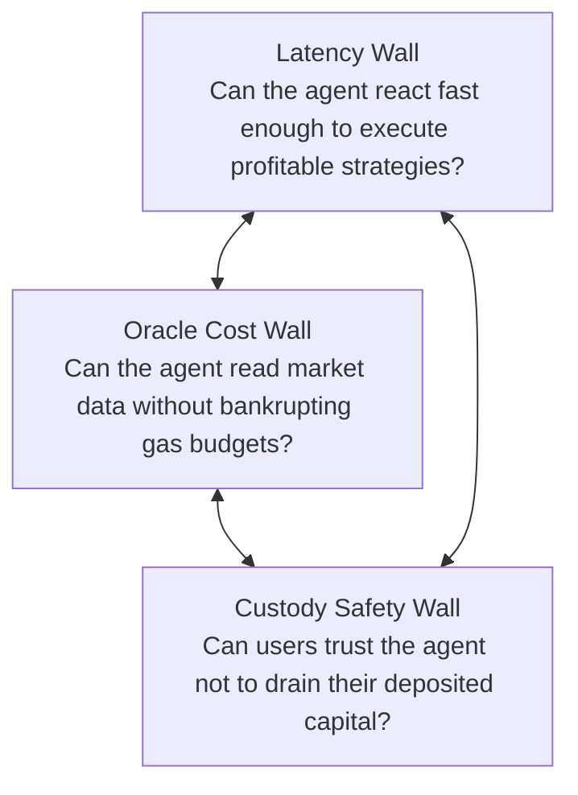

# The Problem Statement

## The Trilemma of On-Chain AI Agents

Autonomous agents represent the future of on-chain activity, yet developers attempting to deploy autonomous intelligence on existing blockchains encounter three structural walls:

---

### 1. The Latency Wall (Slow Execution Engines)

Most smart-contract platforms operate with block times ranging from 1 to 12 seconds:
* **Ethereum**: 12-second slots.
* **Standard Optimistic Rollups**: 2-second block intervals.
* **HyperEVM**: 1-second small blocks with strict 3M gas caps.

When an autonomous agent attempts to maintain tight spreads on a decentralized exchange or hedge against volatility, a multi-second delay is fatal. High-frequency arbitrageurs and MEV searchers pick off the agent’s stale quotes before the agent's cancellation or rebalance transaction is included. 

**The Result**: The agent suffers massive Loss-Versus-Rebalancing (LVR), rendering automated market-making algorithms unprofitable.

---

### 2. The Oracle Cost Wall (Expensive Sensory Feeds)

An intelligent agent must observe the external world before deciding how to act. On traditional EVM networks, reading external market state (orderbooks, mark prices, funding rates) requires **push oracles** (e.g., Chainlink, Pyth).
* Every oracle price update requires an on-chain transaction that consumes storage writes and gas.
* To achieve near-continuous pricing, an oracle network must spend thousands of dollars in gas per day per pair.
* Furthermore, push oracles typically push only a single mid-price—**they cannot provide full orderbook depth, flow imbalances, or expected slippage**.

**The Result**: Agents operate essentially blind, relying on delayed, low-fidelity price feeds while spending substantial capital just to keep state fresh.

---

### 3. The Custody Vulnerability (Private Key Exposure)

To automate trading, traditional bots usually rely on one of two flawed custodial designs:
1. **Full Private Key Handover**: The user exports their wallet private key or seed phrase into a centralized server hosting the bot daemon. If that server is compromised, all user assets are stolen.
2. **Custodial Bot Vaults**: Users deposit capital into a pooled smart contract where the operator retains full upgradeability or withdrawal authority, exposing users to rug-pulls and smart-contract exploits.

**The Result**: Institutional capital and cautious retail users refuse to allocate significant funds to automated on-chain agents.

---

### 4. The Fragmented Agent Economy

Beyond execution limitations, the Web3 AI ecosystem suffers from market fragmentation:
* **No Standard Discovery Hub**: Creators build specialized AI algorithms in isolation, but have no permissionless venue to market their services or monetize their models.
* **No Trustless Hiring Mechanism**: Users cannot hire an agent with milestone-based escrow. If a user pays upfront, the bot creator can disappear; if the user pays after, the bot creator risks non-payment.
* **Ecosystem Monotony on Elysium**: Currently, the Elysium and Hyperliquid builder landscape is dominated exclusively by standard AMMs, basic lending forks, and NFT launchpads. **There is not a single dedicated autonomous agent marketplace or execution runtime on Elysium.**
