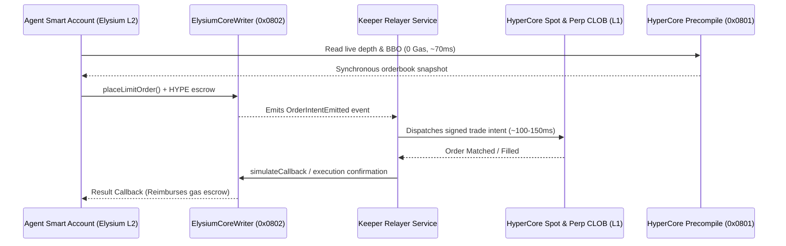

# HyperCore Connectivity

## Bridging the L2 to the Hyperliquid Orderbook

The defining technical advantage of Elysium is its **co-location with HyperCore** (Hyperliquid's high-speed consensus and matching engine running at ~70 ms block cadence). 

Nexus Agents utilizes two specialized interfaces to connect Elysium smart contracts to HyperCore:

```


---

## 1. The Sensory Edge: HyperCore Market Data Precompile

Shipping in an ArbOS network upgrade ~4 weeks post-mainnet, Elysium embeds a chain-native precompile that exposes live HyperCore state directly to any Solidity contract.

### Capabilities
* **Orderbook Depth**: Query Best Bid and Offer (BBO) or multi-tick depth.
* **Price Feeds**: Real-time spot, oracle, and mark prices.
* **Account Analytics**: Query account balances, margin ratios, and open perpetual positions.
* **Computed Metrics**: Read flow imbalance and expected slippage for a designated trade size.

### Technical Performance
* **Granularity**: HyperCore block cadence (~70 ms).
* **Freshness inside EVM**: ~150–350 ms perceived freshness.
* **Cost**: Paid entirely in standard EVM call gas—**zero storage writes, zero relayer fees, and zero oracle push costs**.
* **Auditability**: Every precompile response commits to the exact HyperCore block height and derived bytes, ensuring deterministic replayability during rollbacks or fraud proofs.

---

## 2. The Action Edge: `ElysiumCoreWriter` Predeploy

While the precompile handles high-speed observation, `ElysiumCoreWriter` provides the execution lane from Elysium contracts to HyperCore’s books.

### How Order Execution Works:
1. **One-Time Account Binding**: The user’s Agent Smart Account authorizes a **Trade-Only Agent Key** on HyperCore. HyperCore protocol rules enforce that this key **can never transfer or withdraw capital**.
2. **Intent Emission**: The agent contract emits a structured limit order intent on Elysium via the `ElysiumCoreWriter` predeploy, attaching a micro-escrow in native HYPE.
3. **Keeper Relay**: A keeper service (managed by Nexus or run by third parties) observes the intent, signs the order using the authorized agent key, and pushes it to HyperCore.
4. **Sub-150ms Execution**: The order lands on HyperCore’s central limit order book in approximately one HyperCore block (~70–140 ms).
5. **On-Chain Callback**: If opted in, HyperCore’s execution receipt triggers an asynchronous callback back to the originating contract on Elysium, refunded from the HYPE escrow.
