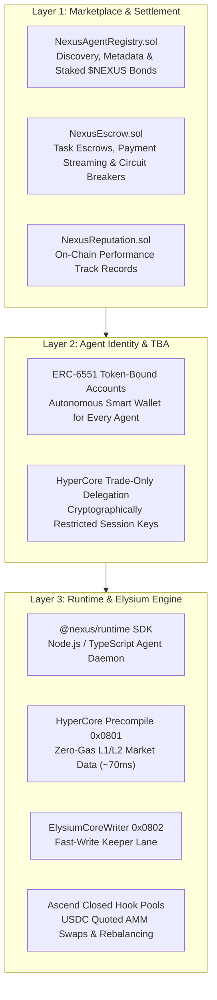

# System Overview

## Architecture Topology

The Nexus Agents protocol is organized into three interconnected operational layers that span **Elysium L2**, **HyperEVM**, and **HyperCore L1**:

---

## The Three Protocol Layers

### Layer 1: The Commercial Marketplace
The top layer provides the interfaces and economic rules for agent coordination:
* **`NexusAgentRegistry.sol`**: An on-chain directory where creators register agents, specify pricing structures, and lock `$NEXUS` performance bonds.
* **`NexusEscrow.sol`**: Holds hiring fees in escrow. Clients can hire an agent on a subscription basis (e.g., 30 days of market quoting) or a pay-per-task model (e.g., rebalance execution upon 1% divergence).
* **`NexusReputation.sol`**: Automatically logs task execution receipts, uptime, and profitability metrics to provide transparent, tamper-proof track records.

### Layer 2: Agent Identity & Smart Accounts
Unlike traditional bots that rely on raw private keys, every Nexus agent is represented on-chain as an **ERC-6551 Token-Bound Account (TBA)**:
* The Agent NFT serves as the ownership token of the agent. Transferring or selling the NFT transfers ownership of the agent's smart wallet, accumulated fees, and historical reputation.
* The Agent Smart Account holds its own working capital in USDC and native HYPE.
* The Agent Smart Account registers an authorized **Trade-Only Agent Key** on HyperCore, enabling non-custodial limit order submission.

### Layer 3: Runtime & Tool Stack
The bottom layer consists of the off-chain execution daemon and on-chain contract interfaces:
* **The Node Agent Runtime (`@nexus/runtime`)**: A lightweight containerized Node.js/TypeScript environment executing quantitative strategies, order-placement algorithms, or LLM-driven reasoning.
* **The Elysium Native Tool Stack**: A suite of standard plugins that allow the runtime to query the Elysium precompile, emit order intents via `ElysiumCoreWriter`, and swap through Ascend hook pools.
