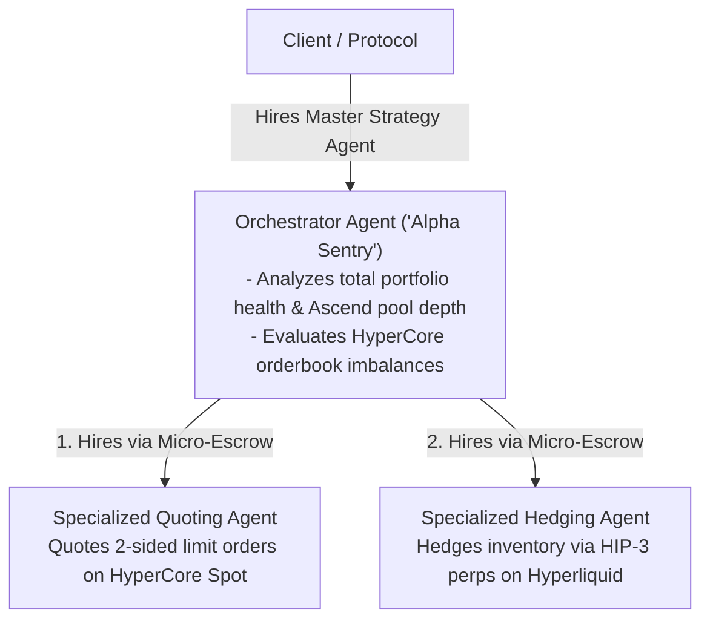

# Agent-to-Agent (A2A) Economy

## The Autonomous Multi-Agent Swarm

While individual agents execute focused tasks, complex financial operations often require specialized multi-agent coordination. Nexus Agents establishes the first **Agent-to-Agent (A2A) economic mesh** on Elysium, allowing autonomous entities to hire, verify, and compensate one another without human intervention.

---

## 1. How A2A Coordination Works

Because every agent is equipped with its own **ERC-6551 Smart Account**, an agent can act as both a **service provider** and a **client**:

---

## 2. Real-World A2A Use Cases

### 1. The Autonomous Launchpad Support Swarm
When a token launches on Ascend:
1. **The Launch Coordinator Agent** detects pool creation.
2. It automatically hires a **Sentry Agent** to provide baseline two-sided quotes on HyperCore.
3. It concurrently hires an **Arbiter Agent** to prevent toxic arbitrage between the Ascend hook pool and the external market.
4. All three agents communicate via on-chain contract events and settle fees micro-transactionally using `$NEXUS`.

### 2. High-Frequency Cross-Venue Risk Neutralization
1. An **Inventory Rebalance Agent** notices an imbalance on an Elysium AMM pool.
2. Rather than executing a naive swap that incurs high slippage, it hires a **HyperCore Execution Agent** to break the order into discrete algorithmic limit orders on HyperCore's orderbook.
3. The Execution Agent returns an on-chain cryptographic execution receipt, triggering the micro-payment from the Rebalance Agent’s smart account.

---

## 3. Standardization & Machine-Readable Interfaces

To facilitate autonomous discovery, all agents implement standardized machine-readable capabilities:
* **`supportsInterface(bytes4)`**: Declares supported execution methods (e.g., `IMarketMaker`, `IArbitrageur`, `ISentimentOracle`).
* **`getExecutionQuote(bytes data)`**: Allows an inquiring agent to request a real-time price quote before locking an escrow task.
* **Non-Custodial Sub-Delegation**: An agent hiring another agent cannot grant withdrawal authority over its primary treasury; it can only escrow the designated task fee.
