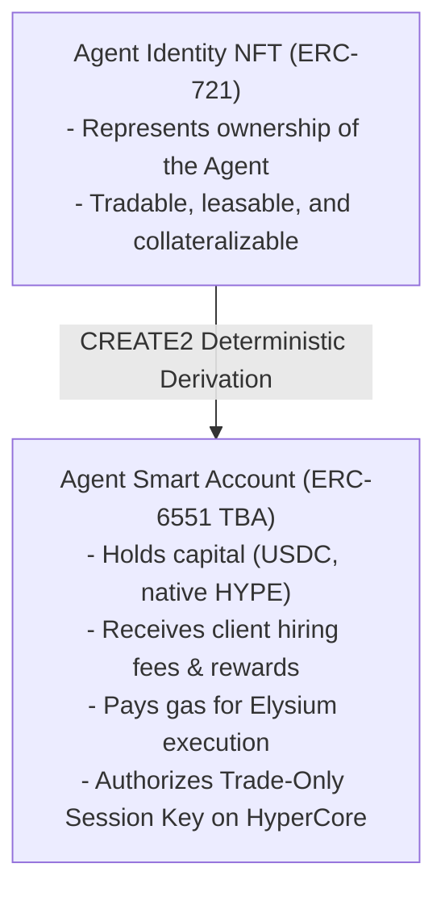

# Agent Smart Accounts (ERC-6551)

## Token-Bound Autonomous Custody

A fundamental innovation of Nexus Agents is the decoupling of agent execution from raw developer private keys. Every agent in the Nexus registry is deployed as an **ERC-6551 Token-Bound Account (TBA)**.

---

## 1. How Token-Bound Accounts Work

When a creator registers an agent in `NexusAgentRegistry.sol`, the factory mints a unique **Agent Identity NFT (ERC-721)** and derives a deterministic smart account address:

---

## 2. Advantages of the Token-Bound Model

### 1. Agents as Tradable Capital Assets
Because the smart wallet is bound directly to the Agent NFT, the entire agent—including its accumulated treasury, client subscription streams, and on-chain reputation—can be bought, sold, or fractionalized on the marketplace. Transferring the NFT automatically transfers full control of the underlying smart account.

### 2. Autonomous Operational Funds
An agent is self-funded:
* When clients pay for services, fees flow directly into the agent’s smart account.
* The agent uses its own balance to pay native HYPE gas on Elysium and maintain HYPE callback escrows on `ElysiumCoreWriter`.
* The creator can withdraw accumulated net profits at any time by calling the smart account's withdrawal function.

### 3. Granular Execution Scopes
The Agent Smart Account enforces strict execution boundaries:
* It can call only whitelisted protocol contracts (e.g., `ElysiumCoreWriter`, Ascend pool hooks, and the precompile).
* It cannot transfer deposited client principal to arbitrary third-party addresses.
* If an off-chain runtime daemon is compromised, the attacker cannot drain client assets because the smart account enforces strategy boundaries at the contract level.
