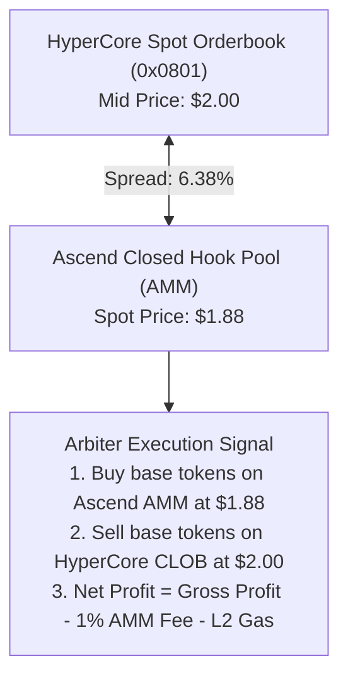

# Arbiter Cross-Venue Arbitrage Strategy

The **Arbiter Strategy** (`ArbiterStrategy.ts`) is designed for cross-venue statistical arbitrage between **Ascend Hook Pools (AMM on Elysium)** and **HyperCore Spot Markets (CLOB)**.

---

## The Cross-Venue Opportunity

When tokens launch via the Ascend Launch Framework, liquidity is initially concentrated in Ascend Closed Hook Pools (quoted in USDC). As price discovery occurs, discrepancies naturally arise between the AMM pool reserves and HyperCore's central orderbook.

The Arbiter continuously monitors both venues and executes atomic two-leg trades whenever the price disparity exceeds the total round-trip transaction costs.



---

## Mathematical Formulation

1. **Raw Spread**:
   $$\text{Spread Bps} = \left|\frac{P_{\text{HyperCore}} - P_{\text{Ascend}}}{P_{\text{Ascend}}}\right| \times 10,000$$

2. **Net Spread**:
   Ascend launch pools assess a **1.00% trading fee** ($100\text{ bps}$):
   $$\text{Net Spread Bps} = \text{Spread Bps} - 100\text{ bps}$$

3. **Profitability Condition**:
   $$\text{Net Profit} = \left(|P_{\text{HyperCore}} - P_{\text{Ascend}}| \times \text{Size}\right) - \text{Fee}_{\text{Ascend}} - \text{Gas}_{\text{Elysium}} > 0$$

If $\text{Net Spread Bps} > \text{Target Spread Bps}$ and $\text{Net Profit} > 0$, the strategy emits an execution signal.

---

## Code Example

```typescript
import { ArbiterStrategy, AgentConfig, StrategyType } from "@nexus/runtime";

const config: AgentConfig = {
  agentId: 2,
  name: "Nexus-Arbiter-01",
  strategyType: StrategyType.ARBITER,
  tickerIndex: 1,
  rpcUrl: "http://127.0.0.1:8545",
  accountAddress: "0x...",
  targetSpreadBps: 30, // 0.30% minimum net profit threshold
  rebalanceThresholdBps: 50,
  maxInventoryToken: 10000n * 1000000n,
  maxInventoryUsdc: 20000n * 1000000n
};

const arbiter = new ArbiterStrategy(config);
const opp = arbiter.evaluateSpread(marketSnapshot, ascendPoolPrice);

if (opp.hasOpportunity) {
  const intent = arbiter.buildHyperCoreIntent(opp);
  // Emits limit order intent via CoreWriterPlugin
}
```

---

## Next Steps
* [Explore Sentry Market Maker](sentry-strategy.md)
* [Review Developer Quickstart](../09-developer-guide/quickstart.md)
