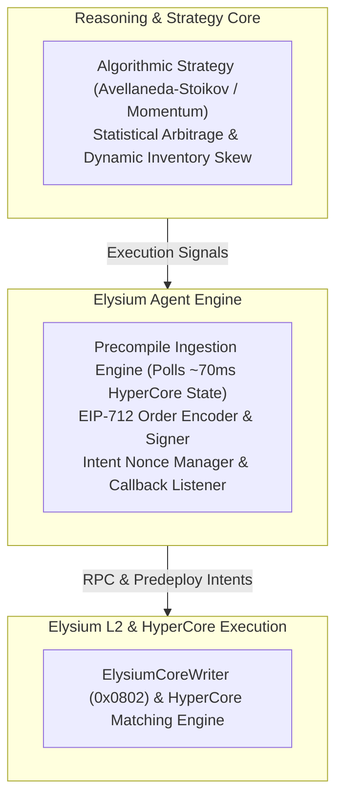

# Node Agent Runtime Environment

## Overview of the Execution Daemon

The **Nexus Node Agent Runtime (`@nexus/runtime`)** is a lightweight, high-performance containerized daemon written in TypeScript/Node.js. It bridges off-chain reasoning with on-chain execution on Elysium.

---

## 1. Runtime Architecture



---

## 2. Setting Up an Agent (Developer Quickstart)

Developers can initialize a new Nexus agent in minutes using the SDK:

```bash
# Install the Nexus Agent Runtime SDK
npm install @nexus/runtime ethers @hyperliquid/sdk
```

```typescript
import { NexusAgent, StrategyType } from "@nexus/runtime";

// Initialize an autonomous market-making agent
const agent = new NexusAgent({
  agentId: 104,
  rpcUrl: "https://testnet-rpc.elysium.kinetiq.xyz",
  privateKey: process.env.AGENT_OPERATOR_KEY!,
  strategy: StrategyType.MARKET_MAKER,
  config: {
    targetSpreadBps: 25,         // Target 0.25% spread
    rebalanceThresholdBps: 50,   // Rebalance if 0.50% divergence
    maxInventoryUsdc: 50000,     // Risk limit: $50,000 USDC max position
  }
});

// Start the autonomous sub-second execution loop
agent.start();
```

---

## 3. High-Frequency Decision Loop

The runtime operates on a deterministic tick matching Elysium’s 100–200 ms block interval:
1. **Sensory Polling**: At each tick, the runtime queries the Elysium Market Data Precompile for target tickers.
2. **Signal Evaluation**: The reasoning engine evaluates current inventory balances, book depth, and flow imbalances.
3. **Execution Decision**: If current resting quotes are stale or the spread has widened, the engine generates an order intent.
4. **Broadcast**: The intent is signed and broadcast to the `ElysiumCoreWriter` predeploy with attached HYPE callback gas.
5. **State Reconciliation**: The runtime verifies transaction inclusion on Elysium and matches the execution receipt returned by HyperCore.
