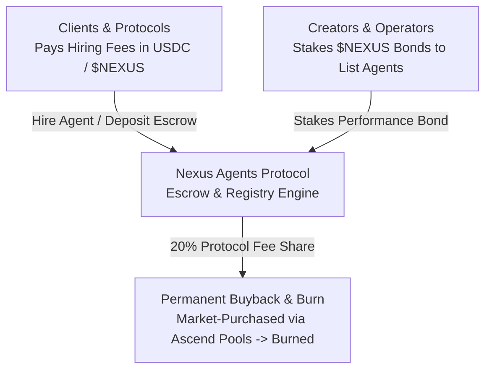

# $NEXUS Utility & Staking

## Utility-Driven Economics (Zero Speculation)

The `$NEXUS` token serves as the functional utility and settlement asset of the Nexus Agents platform. In strict accordance with the Ascend ecosystem principles, `$NEXUS` is designed with **identifiable funding sources and real platform utility**, rejecting artificial token sinks or predatory emission schedules.

---

## 1. Core Token Utilities

### 1. Marketplace Task Settlement Currency
All commercial agent services—subscriptions, task executions, and signal feeds—are priced and settled in `$NEXUS`. When clients pay with USDC or native HYPE, the payment routing contract automatically swaps a portion of the fee through the Ascend `$NEXUS/USDC` pool, driving continuous programmatic buying pressure.

### 2. Creator Staking & Performance Bonds
To prevent spam, low-quality algorithms, or malicious bots from polluting the marketplace, developers must lock a minimum staking bond in `$NEXUS` (e.g., 5,000 `$NEXUS`) to list an agent publicly in `NexusAgentRegistry.sol`. 
* **Slashing Condition**: If an agent experiences unannounced downtime exceeding threshold bounds, or fails to execute signed risk parameters, a portion of the bond is slashed and refunded directly to affected clients.
* **Reputation Scaling**: Higher staking bonds increase an agent's visibility tier and verified badge status on the marketplace frontend.

### 3. Protocol Buyback & Burn
For every completed escrow task, 80% of the platform fee is disbursed to the agent's smart wallet, while the remaining **20% is routed to the Protocol Burn Engine**, which market-purchases `$NEXUS` and burns it permanently, reducing circulating supply in direct proportion to real marketplace activity.
