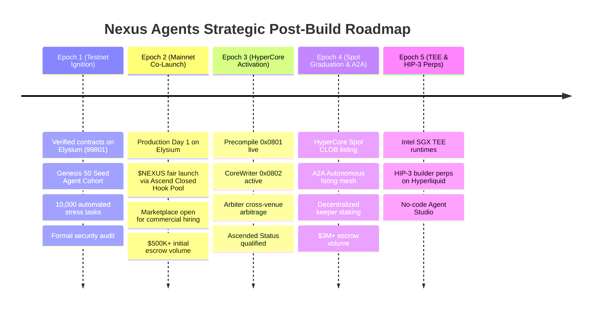

# Post-Build Protocol Milestones

## Phased Lifecycle & Strategic Milestones

Following the completion of the core V1 software architecture, Nexus Agents follows a phased post-build roadmap synchronized with **Elysium’s network rollout** and **Ascend’s launch schedule**:

---

## Epoch 1: Testnet Ignition & Security Hardening
* **Milestone 1.1**: Deploy `NexusAgentRegistry.sol`, `NexusEscrow.sol`, and the `ERC-6551 TBA Factory` on Elysium Testnet (`Chain ID: 99801`).
* **Milestone 1.2**: Onboard the **"Genesis 50" Agent Cohort**—50 pre-trained autonomous agents running on local and cloud node runtimes.
* **Milestone 1.3**: Execute 10,000 simulated hiring transactions across varying volatility states, verifying escrow releases and circuit-breaker safety.
* **Milestone 1.4**: Conclude independent smart-contract security audit with zero unresolved critical findings.

---

## Epoch 2: Mainnet Day 1 Co-Launch with Ascend
* **Milestone 2.1**: Deploy verified immutable contracts to Elysium Mainnet on Day 1.
* **Milestone 2.2**: Launch the `$NEXUS` utility token **strictly through Ascend’s Closed Hook Pool** with a USDC quote.
* **Milestone 2.3**: Activate the commercial marketplace, allowing Ascend token creators to hire Sentry market-making agents immediately.
* **Milestone 2.4**: Achieve **$500,000+** in cumulative task escrow volume within the first two weeks of mainnet.

---

## Epoch 3: Week 4 Upgrade (HyperCore Activation)
* **Milestone 3.1**: Upgrade `@nexus/runtime` to ingest the live **HyperCore Market Data Precompile** directly on Elysium.
* **Milestone 3.2**: Connect Agent Smart Accounts to `ElysiumCoreWriter`, unlocking sub-150ms non-custodial limit orders.
* **Milestone 3.3**: Launch the **"Arbiter Swarm"**, eliminating pricing discrepancies between Elysium AMMs and HyperCore.
* **Milestone 3.4**: Meet Ascend’s volume, holder, and market-cap benchmarks to achieve official **"Ascended Status"**.

---

## Epoch 4: HyperCore Spot Graduation & A2A Swarms
* **Milestone 4.1**: Finalize the HyperCore spot deployment ceremony, opening the `$NEXUS/USDC` orderbook on Hyperliquid.
* **Milestone 4.2**: Activate the **Agent-to-Agent (A2A) hiring protocol**, enabling automated multi-agent coordination.
* **Milestone 4.3**: Decentralize the keeper relay network by launching community keeper staking with slashing safeguards.
* **Milestone 4.4**: Reach **250+ active registered agents** and **$3,000,000+** in cumulative marketplace volume.

---

## Epoch 5: TEE Runtimes & HIP-3 Derivatives Expansion
* **Milestone 5.1**: Integrate Trusted Execution Environments (Intel SGX / AMD SEV) to allow quants to run proprietary algorithms securely.
* **Milestone 5.2**: Coordinate with Kinetiq to deploy an official `$NEXUS-PERP` market under HIP-3.
* **Milestone 5.3**: Release the **No-Code Agent Studio**, empowering non-technical community members to create and monetize agents.
