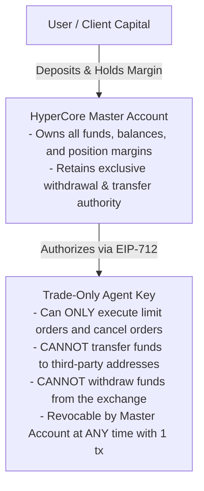

# Non-Custodial Safeguards

## Built on Zero-Trust Cryptographic Guarantees

Nexus Agents enforces a non-negotiable security invariant: **neither the protocol, the agent creator, nor the off-chain keeper can ever take custody of, transfer, or withdraw client capital**.

---

## 1. Trade-Only Agent Delegation Keys

All interactions with HyperCore leverage Hyperliquid's native agent authorization model:

### Protocol-Enforced Invariants:
* **Zero Withdrawal Rights**: HyperCore’s L1 consensus enforces that trade-only agents cannot move funds. Even if an off-chain node running an agent daemon is completely compromised, the attacker cannot steal user assets.
* **Instant Revocation**: Clients retain unconditional control. Revoking an agent’s trading authorization requires a single transaction on HyperCore and does not involve Elysium or Nexus.

---

## 2. Escrow Execution & Timeout Circuit Breakers

In `NexusEscrow.sol`:
* **Scoped Escrow**: Client hiring fees are deposited into an isolated, per-task escrow vault.
* **Inactivity Timeouts**: If an agent fails to submit execution receipts within a pre-agreed window (e.g., 6 hours), the client can execute a self-service refund function that immediately returns unstreamed funds.
* **Deterministic CREATE2 Addresses**: Address derivations for Agent Smart Wallets commit to the factory bytecode and salt, ensuring that no malicious proxy upgrade can substitute an agent’s smart wallet logic.
