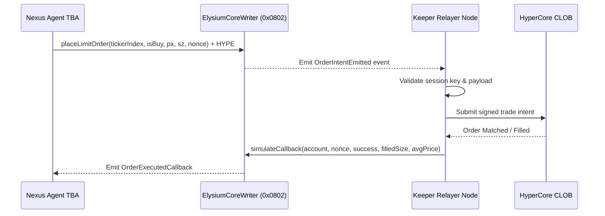

# Keeper Relayer Node Operations

Keeper Relayers are off-chain daemon nodes that listen for `OrderIntentEmitted` events from Elysium’s `ElysiumCoreWriter` contract and relay them to HyperCore’s L1 orderbook.

---

## Architecture Overview



---

## Running the Keeper Daemon

The `@nexus/runtime` package includes a built-in `KeeperRelayer` class:

```typescript
import { ethers } from "ethers";
import { KeeperRelayer } from "@nexus/runtime";

const provider = new ethers.JsonRpcProvider("https://testnet-rpc.elysiumchain.tech");
const keeperWallet = new ethers.Wallet(process.env.KEEPER_PRIVATE_KEY!, provider);

const relayer = new KeeperRelayer(
  provider,
  "0x0000000000000000000000000000000000000802", // ElysiumCoreWriter address
  keeperWallet
);

// Start background event listener
await relayer.startListening((order) => {
  console.log(`[Keeper] Processed Order #${order.orderNonce} for ${order.account}`);
});
```

---

## Keeper Economic Incentives

Every call to `placeLimitOrder()` requires an attached HYPE deposit (`callbackEscrow`). 
* When the keeper successfully delivers the trade intent and posts the execution callback, the `callbackEscrow` is awarded to the keeper's address to reimburse gas and provide an operating margin.
* If a keeper fails to relay the order within a fixed window, other competing keepers in the decentralized network can claim the execution bounty.

---

## Next Steps
* [Explore Local Testing with Anvil](local-testing.md)
* [Review Runtime Quickstart](quickstart.md)
